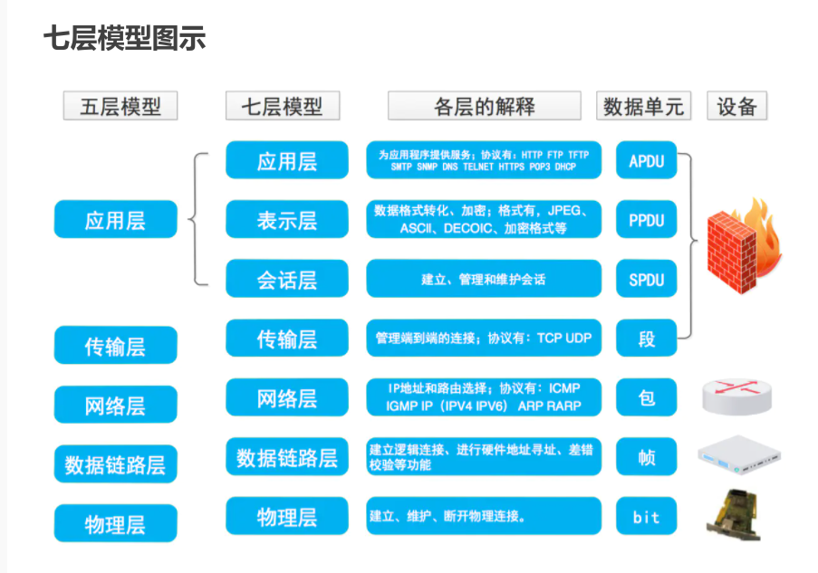
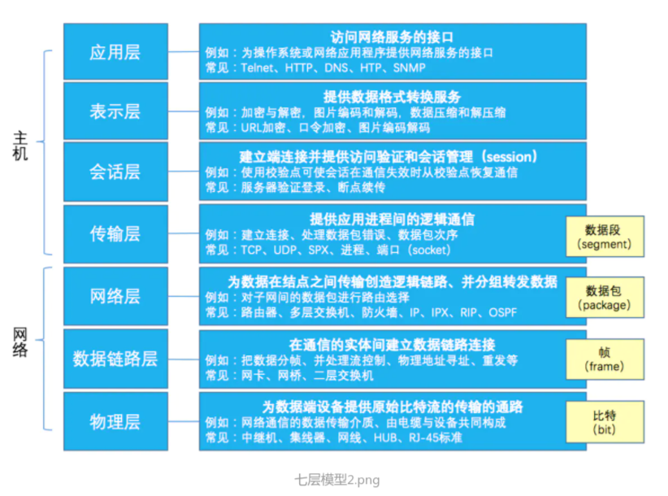
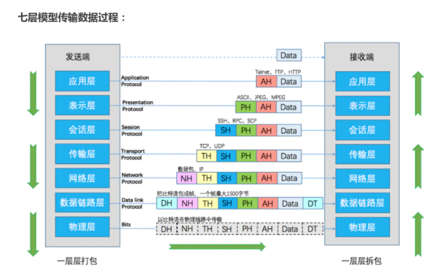

# 一、信息安全

## 基本目标

### 基本属性（CIA）

机密性、完整性、可用性

### 其他属性

真实性、可问责性、不可否认性、可靠性

# 二、TCP/IP协议簇

OSI7层模型和TCP/IP五层模型

### 硬件配置

#### 中继器

处于物理层

#### 网卡

物理层和数据链路层

### 数据包

- 传输层叫做段(segment)
- 在网络层叫做数据报 (datagram)
- 在链路层叫做帧(frame)
- 物理层叫做bit

## 应用层

### BGP协议

Border Gateway Protocol 是一个应用层协议，运行在TCP协议之上，端口号179

- BGP协议是用于自治系统AS之间的动态路由协议
- 是一种外部网关协议，与OSPF、RIP等内部网关协议不同，其着眼点不在于发现和计算路由，而是着眼于在AS之间控制路由的转播和选择最佳路由

### pop3和imap协议：

1. POP服务器侦听端口110，而带SSL安全（POP3DS）服务器的POP在端口995上侦听；

   IMAP服务器侦听端口143，带有SSL安全（IMAPDS）服务器的IMAP侦听端口993。

2. POP3将邮件从服务器下载到单台计算机，然后将其从服务器删除。

   而 IMAP 则可以通过在邮件客户端和邮箱服务器之间进行双向同步的功能来避免这种情况

### FTP协议

- FTP是仅基于TCP的服务，不支持UDP

- 与众不同的是FTP使用2个端口，一个数据端口和一个命令端口（也可叫做控制端口）

  通常来说这两个端口是21（命令端口）和20（数据端口）

- FTP具有两种模式，分别是port模式(主动模式)和pasv模式(被动模式)

### Http协议

当访问Web网站的某个页面资源不存在时，HTTP服务器发回的响应状态代码  404

#### HTTP服务器响应的状态码

- 1XX：临时的响应。客户端在收到常规响应之前，应准备接收一个或多个1XX响应

- 2XX：服务器成功的接收了客户端请求

- 3XX：客户端浏览器必须采取更多操作来实现请求。例如，浏览器可能不得不请求服务器上的不同页面，或者通过代理服务器重复该请求

- 4XX：发生错误，客户端似乎有问题。例如：客户端请求不存在的页面，客户端未提供有效的身份验证信息

- 5XX：服务器遇到错误而不能完成该请求

## 网络层

### ICMP协议

- ICMP封装在IP数据报的数据部分
- ICMP消息的传输是不可靠的
- ICMP是IP协议的必需的一个部分
- ICMP可用来进行拥塞控制

### IP协议

IP和IPsec都是工作在网络层

#### 关于IPv4地址

- IP地址的总长度为32位
- 每一个IP地址都由网络地址和主机地址组成
- 一个C类地址拥有8位主机地址，可给254台主机分配地址

#### 关于ipv6地址

IPV4的32位地址共40多亿个，IPV6的128位地址是IPV4地址总数的2^96^倍

## 数据链路层

### PPP 协议

PPP（点到点协议）是为在同等单元之间传输数据包这样的简单链路设计的一个协议

### ARP协议

- ARP表用于建立IP地址到MAC地址的映射
- 受到了ARP欺骗的计算机发出的数据包目的MAC地址是错误的

# 三、密码学

## 密码学的安全目标的三个方面：

保密性、完整性、可用性

## 序列密码算法

RC4、A5/1、SEAL等；

#### 关于序列密码

- 序列密码是单独地加密每个明文位；

- 由于序列密码小而快，所以它们非常合适计算资源有限的应用；

- 序列密码的加密和解密使用相同的函数；

## 分组密码算法

### DES

- DES 是一种分组密码
- DES 是对合运算,因而加密和解密共同一算法
- DES 综合运用了置换、代替、代数等多种密码技术
- DES ==不是==面向十六进制的密码算法

#### DES的缺点

- 密钥较短
- 存在弱密钥
- 存在半弱密钥

#### AES

## 公开密码机制（非对称加密机制）

### RSA

- RSA 算法具有加解密算法的可逆性,加密和解密运算可交换
- RSA 密码的核心运算是模幂运算
- RSA 算法可同时确保数据的秘密性和数据的真实性

## Hash算法

- 安全散列算法是 FIPS 所认证的安全杂凑算法
- 安全哈希算法主要适用于数字签名标准里面定义的数字签名算法
- 哈希算法输出的字符串一般称为 Hash 值

## 密码应用

### CFS

CFS是一个经典的加密文件系统

- CFS使用DES来加密文件
- CFS客户基于网络文件系统协议运行一个服务器保护程序
- CFS的加密操作在用户层完成
- CFS的效率**不**高

### TCFS

TCFS是一个受CFS启发的Linux软件包

- TCFS具有更大的透明度，用户甚至不需要知道他们的文件被加密了

- TCFS对数据进行加密时，对每个文件使用不同的“文件密钥”进行加密

  对一个文件的不同部分使用的是不同的“块密钥”进行加密

- TCFS的数据加密、解密操作在核心层完成

- TCFS对文件名、文件大小、访问时间、目录结构等一些敏感信息==没有==很好的保护

# 不同语言的代码规范

## PHP 安全编码规范

- 在 PHP 中，可以直接使用“0/1”代替“true/false”
- 在 PHP 项目中，“/scripts”路径下默认存放图片文件
- 在 PHP 项目中，可以将独立的功能模块写成函数

## python规范

默认编码格式：utf-8

# 网络空间安全保障和安全运维

## 威胁情报

### 安全威胁情报基本特征

- 时效性
- 相关性
- 准确性

## 网络安全态势

#### 网络安全态势感知三个层次

感知、理解、预测

#### 网络安全态势的预测方法

神经网络是目前最常用的网络态势预测方法

## 质量管理

#### PDCA 循环的含义是将**质量管理**分为四个阶段

计划（plan）、执行（do）、检查 （check）、处理（Act）

## 信息系统安全运营

### PDRR 安全模型

- PDRR 模型包括防护（Protection）、 检测（Detection）、响应（Reaction）和恢复（Recovery）四个部分

- PDRR 是一个动态的信息系统安全运营模型

- PDRR 模型中，检测部分的功能就是检测入侵者的身份

- 除PDRR模型之外，还有==WPDRRC 模型==、==PPDR 模型==等都是信息系统安全运营模型

## 信息安全防护框架

- 网络层安全管控：最下方；网络安全域控制，网络准入控制，网络流量分析及监测
- 虚拟层安全管控
- 系统层安全管控
- 应用层安全管控
- 数据层安全管控
- 用户层安全管控：最上方

## 信息系统安全防护体系建设

- 确定安全域是企业信息系统安全防护体系建设的首要任务
- 划分安全域可以设立清晰的防护边界对系统进行保护
- 划分安全域前需要确定企业信息系统安全防护体系的防护范围
- ==可以==将相同安全防护需求的对象划分到同一个安全域

## 安全策略设计原则

- 先急后缓
- 先众后寡
- 先端后网

## 数据融合层次

- 原始数据融合
- 特征级融合
- 决策级融合

## 网络取证(network forensics)

抓取、记录和分析网络事件以发现安全攻击或其他的问题事件的来源

### 特点

动态、实时、多态

### 分类方式

- 按照采集方式进行分类
- 按照取证时延性进行分类
- 按照不同的视角进行分类

### 特征

- 客观性
- 关联性
- 合法性

## 软件安全性测试

- 狭义的软件安全测试是执行安全测试用例的过程；

- 广义的软件安全测试是所有关于安全性测试的活动

### 终端软件加固包含哪种方式？

终端软件加壳、代码混淆、反动态调试

### 软件静态分析技术

污点分析、数据流分析、语义分析

### 软件动态分析技术

符号执行、Fuzz 分析、沙箱技术

## 网络安全事件的分类分级标准

1为最大、4为最小

# 单词全称

### DDos

Distributed Denial of Service

#### IDS  入侵检测系统

依照一定的安全策略，对网络、系统的运行状况进行监视，其全称为

Intrusion Detection Systems

#### PPP 协议

提供了中在点到点链路上封装网络层协议信息的标准方法，其英文是

The Point-to-Point Protocol

#### 消息认证码MAC

消息内容和秘密钥的公开函数，其英文全称是

Message Authentication Code

#### VPN

Virtual Private Network

#### SNMP

TCP/IP协议簇的一个应用层协议

Simple Network Management Protocol

#### SSH

专为远程登录会话和其他网络服务提供安全性的协议

Secure Shell

#### SDU

Service Data Unit   相邻层间交换的数据单元称之为服务数据单元

#### LDAP

Lightweight Directory Access Protocol	**轻量目录访问协议**

AD（微软的 Active Directory） 是基于 LDAP 协议的一套解决方案（LDAP 服务器 + 应用），解决了细粒度的权限控制。核心：**「谁 以什么权限 访问什么」**。

# 病毒和木马

区别

- 病毒和木马不容易区分清楚；
- 病毒和木马一般可以统称为恶意程序或恶意软件；
- 病毒具有一定的显性破坏性，木马更倾向于默默地窃取；
- 病毒具有自传播性，即能够自我复制，而木马则不具备这一点

#### 冲击波蠕虫利用的是

DCOM RPC缓冲区漏洞

# 风险

## 风险评估的方法大致有三类

定量的风险评估方法、定性的风险评估方法、定性与定量相结合的评估方法

## 容灾系统

衡量容灾系统有两个主要指标：

RPO（Recovery Point Objective）和 RTO（Recovery Time Object）

其中 RPO代表 了当灾难发生时允许丢失的数据量，而 RTO 则代表了系统恢复的时间。 **RPO 与 RTO 越小，系统的可用性就越高**，当然用户需要的投资也越大。

#### 容灾技术范畴

数据容灾、系统容灾、应用容灾

#### 关于远程服务器漏洞和本地漏洞

- 本地漏洞指的是必须登录到安装软件的计算机上才能利用的漏洞

#### 网络监听

网络监听是一种监视网络状态、数据流程以及网络上信息传输的管理工具，它可以将网络界面设定成监听模式，并且可以截获网络上所传输的信息

- 通过向网络监听组件发送含有异常数据的包，有可能触发缓冲区溢出
- 绕过网络监听组件身份验证，可能可以获得合法数据库账号和密码
- 网络监听组件被触发缓冲区重写，可能导致数据库服务器无法响应客户端

#### 路由器在两个网段之间转发数据包时，读取其中的==目标IP==地址来确定下一跳的转发路径

### 

#### 数据报操作特点

- 每个分组自身携带有足够的信息，它的传送是被单独处理的
- 在整个传送过程中，不需建立虚电路
- 网络节点要为每个分组做出路由选择

# 防火墙

## 特点

- 防火墙阻挡对网络的非法访问和不安全数据的传递
- 防火墙的安全规则由匹配条件与处理方式两个部分共同构成
- 防火墙使得本地系统和网络免于受到许多网络安全威胁

- 防火墙==不是==一种动态安全技术

## 经典体系结构

- 双重宿主主机体系结构 
- 被屏蔽主机体系结构 
- 被屏蔽子网体系结构

### 下一代防火墙

不基于互联网及用户自身的动态策略配置

#### 处置响应的配置接口

- 处置IOC
- 处置受害IP
- 事件告警

## 网络蜜罐技术

### 最主要的功能

- 对系统中所有的操作
- 行为进行监视和记录

### 分类

产品型和研究型

### 注意

在受防火墙保护的网络中,蜜罐通常放置在防火墙的外部或放置在防护程度较低的服务网络中

## 显著的缺点

就是防火墙对于应用层没有控制,方便了木马的进入

# 数据备份

#### 完全备份

完全备份是指将系统中所有选择的数据对象进行一次全面的备份，不论数据对象自上次备份之后是否修改过

#### 增量备份

增量备份是指只对上次备份后系统中变化过的数据对象的备份

#### 差分备份

差异备份是指在==**一次全备份**==后到进行差异备份的这段时间内，对那些增加或者修改文件的备份

#### 渐进式备份

系统排除完全备份，数据对象只有当发生改变时才被写入到存储介质上

# 网络服务

QoS（Quality of Service，服务质量）指一个网络能够利用各种基础技术，为指定的网络通信提供更好的服务能力。

#### 网络抖动

网上说法是指网络中的延迟是指信息从发送到接收经过的延迟时间，一般由传输延迟及处理延迟组成；
而抖动是指最大延迟与最小延迟的时间差，如最大延迟是20毫秒，最小延迟为5毫秒，那么网络抖动就是15毫秒，
它主要标识一个网络的稳定性。

#### 时延

网络中的时延是由节点**处理时延**、**排队时延**、**传输时延**、**传播时延**几个不同部分组成的。

#### 系统的可维护性是指系统维护的难易程度，可以使用==平均维修时间==进行评价

# 算法分析

目的是分析算法的效率以求改进

#### S/MIME在RSA数据安全性的基础上加强了互联网E-Mail格式标准MIME的安全性

- 封装数据
- 透明签名数据
- 签名并封装数据

# 系统安全模型

### **四种强制访问控制策略规定**：

下读、上写、上读、下写

其中上读：

是指客体在主体之上时可以进行读取

### Lattice模型

下读、下写

只有主体安全级别大于客体才能读写

### Bell－LaPadula(BLP)模型

下读、上写

保证机密性

### Biba模型

上读、下写

保证完整性

# 安全技术

## 入侵防御系统

入侵防御系统（IPS）不但能精确地检测到攻击行为，而且能通过一定的响应方式实时地终止入侵行为的发生

## 入侵检测系统

## 分类

### 数据源分类

- 基于主机的入侵检测系统（HIDS）

- 基于网络的入侵检测系统（NIDS）

### 检测原理分类

- #### 异常入侵检测

- #### 特征入侵检测

## 入侵检测技术

#### **误用检测技术（特征检测技术）**

收集非正常操作的行为特征，建立相关的特征库，当监测的用户或系统行为与库中的记录相匹配时，系统就认为这种行为是入侵。

总结：收集的是攻击特征

#### **异常检测技术**

首先总结正常操作应该具有的特征（用户轮廓），试图用定量的方式加以描述，当用户活动与正常行为有重大偏离时即被认为是入侵。

总结：收集的是正常特征++

